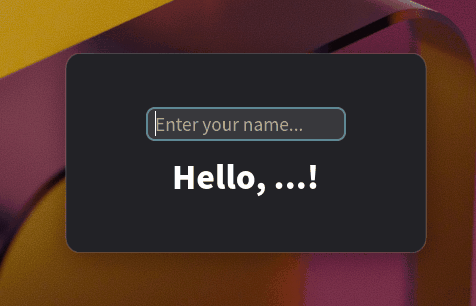

# ReactiveGTK

> [!WARNING]
> This project is in very early development stage and is not ready for production use.
> Breaking changes should be expected at any time. APIs, architecture, and core concepts
> may change significantly without notice. Use at your own risk.

A reactive UI framework for GTK4 applications in Python, inspired by modern reactive programming patterns. Build dynamic, stateful GTK applications with declarative syntax and automatic UI updates.

## Features

ReactiveGTK provides patterns and utilities around GTK4/PyGObject to make building reactive UIs easier:

- 🔄 **Reactive State Utilities**: Wrapper classes for automatic UI updates when state changes
- 🔗 **Data Binding Helpers**: Utilities to keep GTK widgets and state in sync effortlessly
- 📝 **Declarative DSL**: Functional patterns for building GTK UIs with clean syntax
- 🔌 **Type Safety**: Full type hints support for better development experience
- 🎯 **Minimal Dependencies**: Built on top of GTK4, libadwaita, and PyGObject
- 🔍 **Preview System**: Development utilities for rapid component iteration

## Installation

```bash
pip install https://github.com/Microwave-WYB/reactivegtk.git
```

## Why ReactiveGTK?

See the progression from traditional GTK to ReactiveGTK's declarative approach:

### 1. Traditional GTK (Pure GTK)

Classic GTK widget development with manual state management:

```python
import gi

gi.require_versions({"Gtk": "4.0", "Adw": "1"})
from gi.repository import Adw, Gtk


class HelloWorldWidget(Gtk.Box):
    def __init__(self):
        super().__init__(
            orientation=Gtk.Orientation.VERTICAL,
            spacing=12,
            halign=Gtk.Align.CENTER,
            valign=Gtk.Align.CENTER,
        )

        self.name = ""

        self.entry = Gtk.Entry(placeholder_text="Enter your name...", width_request=200)
        self.entry.connect("activate", self._on_entry_activate)
        self.entry.connect("changed", self._on_entry_changed)
        self.append(self.entry)

        self.label = Gtk.Label(css_classes=["title-1"])
        self._update_label()
        self.append(self.label)

    def _on_entry_activate(self, entry: Gtk.Entry) -> None:
        print(f"Entry activated with text: {self.name}")

    def _on_entry_changed(self, entry: Gtk.Entry) -> None:
        self.name = entry.get_text()
        self._update_label()

    def _update_label(self) -> None:
        text = f"Hello, {self.name}!" if self.name else "Hello, ...!"
        self.label.set_text(text)


class App(Adw.Application):
    def __init__(self):
        super().__init__(application_id="com.example.HelloWorld")
        self.connect("activate", self._on_activate)

    def _on_activate(self, app):
        window = Adw.ApplicationWindow(
            application=app,
            title="Hello Traditional GTK"
        )
        window.set_content(HelloWorldWidget())
        window.present()


if __name__ == "__main__":
    app = App()
    app.run([])
```

**Problems:**
- ❌ **Manual state synchronization** between widgets
- ❌ **Boilerplate code** for signal connections and updates
- ❌ **Imperative** - you must tell GTK exactly what to do step by step

### 2. ReactiveGTK (Imperative Style)

Using ReactiveGTK's state management but keeping imperative structure:

```python
import gi

from reactivegtk import MutableState

gi.require_versions({"Gtk": "4.0", "Adw": "1"})
from gi.repository import Adw, Gtk


class HelloWorldWidget(Gtk.Box):
    def __init__(self):
        super().__init__(
            orientation=Gtk.Orientation.VERTICAL,
            spacing=12,
            halign=Gtk.Align.CENTER,
            valign=Gtk.Align.CENTER,
        )

        # Use ReactiveGTK state management
        self.name = MutableState("")

        # Create and configure entry
        self.entry = Gtk.Entry(placeholder_text="Enter your name...", width_request=200)
        self.entry.connect("activate", self._on_entry_activate)
        self.append(self.entry)

        # Create label
        self.label = Gtk.Label(css_classes=["title-1"])
        self.append(self.label)

        # Set up reactive bindings
        self.name.twoway_bind(self.entry, "text")
        self.name.map(lambda x: f"Hello, {x}!" if x else "Hello, ...!").bind(self.label, "label")

    def _on_entry_activate(self, entry: Gtk.Entry) -> None:
        print(f"Entry activated with text: {self.name.value}")


class App(Adw.Application):
    def __init__(self):
        super().__init__(application_id="com.example.HelloWorld")
        self.connect("activate", self._on_activate)

    def _on_activate(self, app):
        window = Adw.ApplicationWindow(
            application=app,
            title="Hello ReactiveGTK (Imperative)"
        )
        window.set_content(HelloWorldWidget())
        window.present()


if __name__ == "__main__":
    app = App()
    app.run([])
```

**Improvements:**
- ✅ **Reactive state** - automatic UI updates
- ✅ **Two-way data binding** - no manual synchronization
- ❌ Still imperative structure

### 3. ReactiveGTK (Declarative DSL)

The same application built with ReactiveGTK's declarative DSL:



```python
from functools import partial
import gi

from reactivegtk import MutableState, apply

gi.require_versions({"Gtk": "4.0", "Adw": "1"})
from gi.repository import Adw, Gtk  # type: ignore # noqa: E402


def HelloWorld():
    # Create reactive state
    name = MutableState("")

    box = Gtk.Box(
        orientation=Gtk.Orientation.VERTICAL,
        spacing=12,
        halign=Gtk.Align.CENTER,
        valign=Gtk.Align.CENTER,
    )

    @apply(box.append)
    def _():
        entry = Gtk.Entry(placeholder_text="Enter your name...", width_request=200)
        name.twoway_bind(entry, "text")
        
        @partial(entry.connect, "activate")
        def _(*_):
            print(f"Entry activated with text: {name.value}")
            print("Multiple prints are possible with multiple statements")
        
        return entry

    @apply(box.append)
    def _():
        label = Gtk.Label(css_classes=["title-1"])
        name.map(lambda x: f"Hello, {x}!" if x else "Hello, ...!").bind(label, "label")
        return label

    return box


# Create and run the app
def App():
    app = Adw.Application(application_id="com.example.HelloWorld")

    @partial(app.connect, "activate")
    def _(*_):
        window = Adw.ApplicationWindow(application=app, title="Hello ReactiveGTK (Declarative)")
        window.set_content(HelloWorld())
        window.present()

    return app


if __name__ == "__main__":
    App().run([])
```

**Full Benefits:**
- ✅ **Declarative syntax** - describe what you want, not how to do it
- ✅ **Reactive state** - UI updates automatically when state changes
- ✅ **Two-way data binding** - no manual synchronization needed
- ✅ **Clean DSL** - build complex UIs with simple decorator patterns
- ✅ **Type-safe** - catch errors at development time

## Core Concepts

### 1. Reactive State

State in ReactiveGTK is reactive - when it changes, all dependent UI elements automatically update.

```python
from reactivegtk import MutableState, State

# Mutable state that can be changed
count = MutableState(0)
count.set(5)  # Set value directly
count.update(lambda x: x + 1)  # Update with function

# Access current value
print(count.value)  # 6

# Derived state that transforms another state
doubled = count.map(lambda x: x * 2)
text = count.map(lambda x: f"Value: {x}")

# Watch state changes
count.watch(lambda new_value: print(f"Count changed to: {new_value}"))
```

**When to use MutableState vs State:**
- Use `MutableState` when you need to modify the state (`.set()`, `.update()`, `.twoway_bind()`)
- Use `State` for read-only derived state or when exposing state in component APIs
- `State` is the base class - you can pass `MutableState` wherever `State` is expected

### 2. Data Binding

Bind state directly to widget properties with automatic updates:

```python
# One-way binding: state → widget (works with both State and MutableState)
name = MutableState("World")
label = Gtk.Label()
name.map(lambda x: f"Hello, {x}!").bind(label, "label")

# Two-way binding: state ↔ widget (only works with MutableState)
text_state = MutableState("")
entry = Gtk.Entry()
text_state.twoway_bind(entry, "text")

# Now when you type in the entry, text_state automatically updates
# And when you call text_state.set("new value"), the entry updates too

# Watch state changes
text_state.watch(lambda new_text: print(f"Text changed to: {new_text}"))

# Transform state before binding
text_state.map(str.upper).bind(label, "label")  # Always uppercase
```

**Note**: Two-way binding (`.twoway_bind()`) only works with `MutableState`, not `State`. This prevents accidental modifications of read-only derived state.

### 3. Effects

Handle side effects and asynchronous operations with the `@effect` decorator:

```python
import asyncio
from functools import partial
from reactivegtk import effect, start_event_loop, apply

# Start the async event loop (call once in your app)
event_loop, thread = start_event_loop()

def AutoIncrementingCounter():
    count = MutableState(0)
    auto_enabled = MutableState(False)
    
    # Auto-increment effect
    @effect(event_loop)
    async def auto_increment_effect(enabled: bool):
        while enabled:
            await asyncio.sleep(1)
            count.update(lambda x: x + 1)
    
    # Watch state changes and pass value to effect
    auto_enabled.watch(auto_increment_effect, init=True)
    
    box = Gtk.Box(orientation=Gtk.Orientation.VERTICAL, spacing=12)
    
    @apply(box.append)
    def _():
        label = Gtk.Label(css_classes=["title-1"])
        count.map(lambda x: f"Count: {x}").bind(label, "label")
        return label
    
    @apply(box.append)
    def _():
        button = Gtk.Button(label="Reset")
        
        @partial(button.connect, "clicked")
        def _(*_):
            count.set(0)
        
        return button
    
    @apply(box.append)
    def _():
        button = Gtk.Button()
        auto_enabled.map(
            lambda enabled: "Stop Auto-increment" if enabled else "Start Auto-increment"
        ).bind(button, "label")
        
        @partial(button.connect, "clicked")
        def _(*_):
            auto_enabled.update(lambda x: not x)
        
        return button
    
    return box
```

### 4. Declarative DSL

ReactiveGTK provides a declarative DSL for building UIs using decorator patterns:

#### `@apply(function)` - Single Item

Configure widgets by applying a function that returns the configured widget:

```python
from functools import partial
from reactivegtk import apply

# Create a box and add a configured button
box = Gtk.Box()

@apply(box.append)
def _():
    button = Gtk.Button(label="Click me")
    
    @partial(button.connect, "clicked")
    def _(*_):
        print("Clicked!")
    
    return button
```

#### `@apply(function).foreach` - Multiple Items

Apply a function to multiple similar items:

```python
# Add multiple widgets to a container
@apply(box.append).foreach
def _():
    return (
        Gtk.Label(label="First"),
        Gtk.Label(label="Second"), 
        Gtk.Button(label="Third")
    )

# Works with any function - equivalent to:
# box.append(Gtk.Label(label="First"))
# box.append(Gtk.Label(label="Second"))
# box.append(Gtk.Button(label="Third"))
```

#### `@apply.unpack(function)` - Single Tuple Unpacking

For unpacking a single tuple as function arguments:

```python
# Attach a single widget to a grid with position data
grid = Gtk.Grid()

@apply.unpack(grid.attach)
def _():
    button = Gtk.Button(label="Submit")
    return (button, 0, 0, 2, 1)  # widget, column, row, width, height

# This is equivalent to: grid.attach(button, 0, 0, 2, 1)
```

#### `@apply.unpack(function).foreach` - Multiple Tuple Arguments

Perfect for grid layouts where you need to unpack multiple tuples:

```python
# Attach multiple widgets to a grid with position and span data
grid = Gtk.Grid()

@apply.unpack(grid.attach).foreach
def _():
    return (
        (Gtk.Button(label="Clear"), 0, 0, 3, 1),  # spans 3 columns
        (Gtk.Button(label="7"), 0, 1, 1, 1),
        (Gtk.Button(label="8"), 1, 1, 1, 1), 
        (Gtk.Button(label="9"), 2, 1, 1, 1),
        (Gtk.Button(label="÷"), 3, 1, 1, 1),
        # ... more buttons
    )

# This is equivalent to:
# grid.attach(Gtk.Button(label="Clear"), 0, 0, 3, 1)
# grid.attach(Gtk.Button(label="7"), 0, 1, 1, 1)
# etc.
```

#### Signal Connections with `@partial`

Use `@partial` for clean signal connections:

```python
from functools import partial

button = Gtk.Button(label="Click me")

@partial(button.connect, "clicked")
def _(*_):
    print("Button clicked!")

# For signals with multiple handlers
entry = Gtk.Entry()

@partial(entry.connect, "activate")
def _(*_):
    print("Entry activated")

@partial(entry.connect, "changed")
def _(*_):
    print("Entry text changed")
```

### 5. Preview System

ReactiveGTK includes a preview application for rapid development:

```python
from reactivegtk import Preview

preview = Preview()

# With explicit name
@preview("HelloWorld")
def hello_preview(_):
    return HelloWorld()

# Without name - uses function name automatically
@preview
def MyLabel(_):
    return Gtk.Label(label="Hello from preview!")

if __name__ == "__main__":
    preview.run()  # Start preview server
```

Run the preview application:

```bash
python demos/hello.py
```

The preview application creates a navigatable window with your components displayed in different tabs, allowing you to quickly test and iterate on your components during development.

## API Reference

### State Classes

- `State[T]`: Base class for reactive state (read-only)
- `MutableState[T]`: Mutable reactive state that can be changed

### State Methods

- `state.value`: Get current value
- `state.set(value)`: Set new value (MutableState only)
- `state.update(fn)`: Update value with function (MutableState only)
- `state.map(fn)`: Create derived state that transforms the value
- `state.bind(widget, prop)`: One-way binding to widget property
- `state.twoway_bind(widget, prop)`: Two-way binding (MutableState only)
- `state.watch(callback)`: Watch for state changes

### DSL Functions

- `@apply(func)`: Configure a single widget with a function
- `@apply(func).foreach`: Apply a function to multiple items
- `@apply.unpack(func)`: Apply a function to a single tuple, unpacking the tuple as arguments
- `@apply.unpack(func).foreach`: Apply a function to multiple tuples, unpacking each tuple as arguments
- `@partial(obj.method, arg)`: Clean signal connection pattern

### Effects

- `@effect(event_loop)`: Decorator for async effects
- `start_event_loop()`: Start async event loop for effects

### Preview System

- `Preview()`: Create preview server
- `@preview` or `@preview(name)`: Register component for preview (uses function name if no name provided)
- `preview.run()`: Start preview application

## Examples

Check out the `demos` directory for complete examples:

- Hello World progression:
  - Traditional GTK ([`demos/hello_traditional.py`](demos/hello_traditional.py))
  - ReactiveGTK Imperative ([`demos/hello_imperative.py`](demos/hello_imperative.py))
  - ReactiveGTK Declarative ([`demos/hello_declarative.py`](demos/hello_declarative.py))
- Counter with auto-increment ([`demos/counter.py`](demos/counter.py))
- Todo List ([`demos/todo.py`](demos/todo.py))
- Multiple Counters ([`demos/multi_counter.py`](demos/multi_counter.py))

## Requirements

- Python 3.10+
- GTK4
- libadwaita
- PyGObject

## License

MIT License - see LICENSE for details
